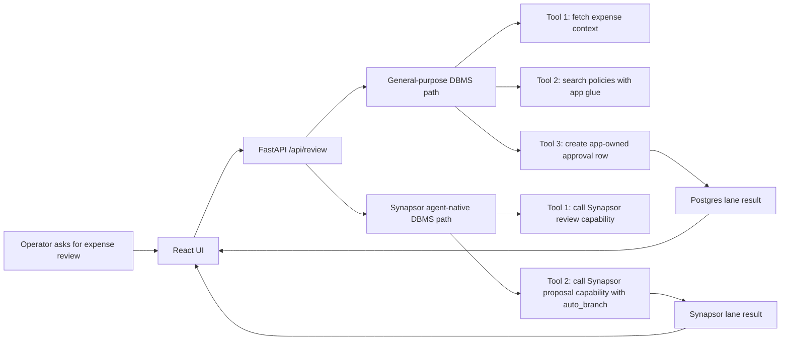
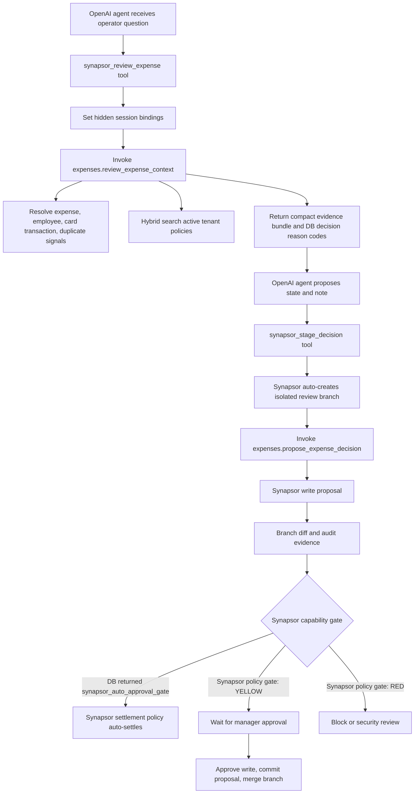
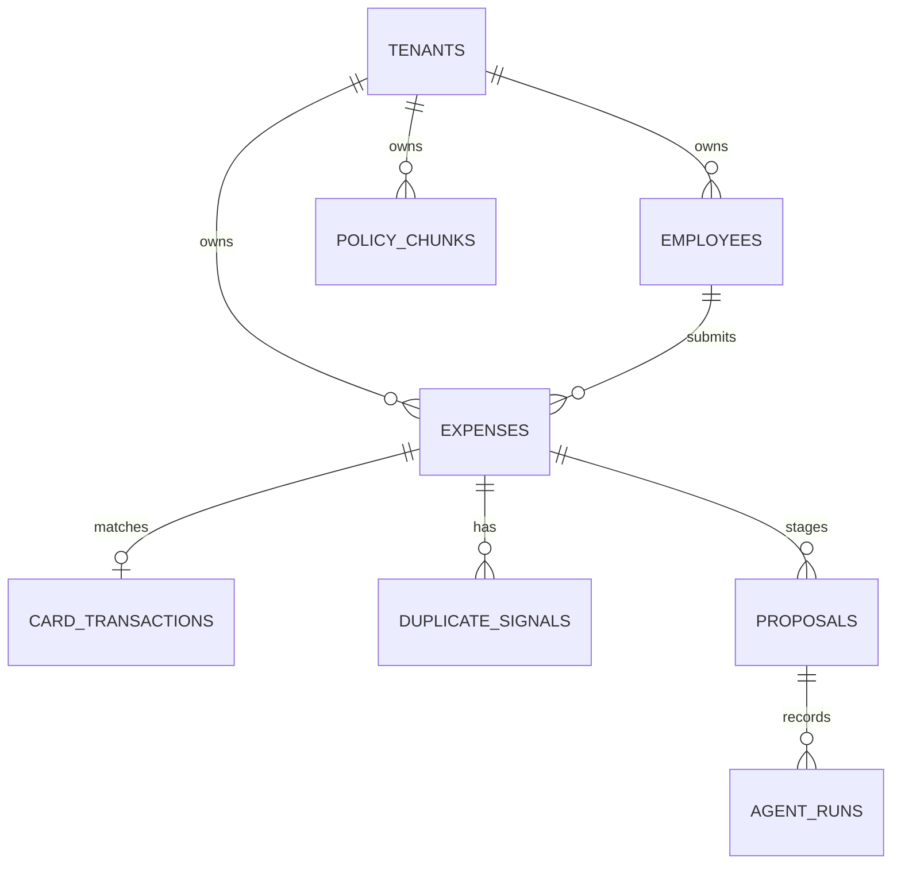

# Synapsor Agent-Native DBMS Demo

This is a runnable [Synapsor](https://synapsor.ai) DBMS demo. Expense Guard is only the sample workload.

Synapsor is the database trust layer for AI agents: it owns session-bound authority, deterministic context, capabilities, hybrid evidence, branch-staged writes, policy gates, write proposals, replayable audit, and Agent Time Travel.

The point is simple: the AI can help with money, but it should not secretly approve bad spending.

The demo compares two live implementations:

| Lane | What It Uses | Trust Boundary |
| --- | --- | --- |
| General-purpose DBMS path | OpenAI Agents SDK, Postgres, pgvector, app-owned policy search, app-owned proposal queue | Safety is assembled in application code, tools, queries, and audit tables. |
| Synapsor agent-native DBMS path | OpenAI Agents SDK, Synapsor sessions, contexts, capabilities, hybrid search, evidence, branches, write proposals, replay, Agent Time Travel | Agent authority and action lifecycle are governed inside the database. |

Both lanes use real database reads and real OpenAI model calls. The UI clears stale metrics for every run, shows a live elapsed timer while each lane is running, and then fills in input tokens, tool calls, database round trips, app glue lines, evidence, proposals, and approval state as soon as that lane returns.

## What The App Does

An operator chooses an expense and asks the agent to review it.

The agent checks:

- Receipt or invoice text.
- Employee and manager.
- Card transaction match.
- Company expense policy.
- Duplicate or fraud risk.
- Prompt injection in receipt text.
- Whether the decision can be approved automatically or needs human review.

The agent returns:

- A business-readable recommendation.
- Evidence used for the decision.
- A staged proposal.
- Metrics comparing the two lanes.

The manager can then approve staged risky proposals. Safe proposals can be auto-approved by policy. In the Synapsor lane, the green/yellow/red business decision comes from the Synapsor capability, writes are staged on a branch first, green-lane writes are auto-approved, auto-committed, and auto-merged by a Synapsor settlement policy, yellow-lane writes wait for a manager, and red-lane writes are blocked or escalated.

The Synapsor policy gate model is:

- Synapsor policy gate: GREEN. A $38 coffee receipt with matching card transaction, receipt present, no duplicate signal, and active meal policy is auto-approved, committed, and merged by Synapsor settlement policy.
- Synapsor policy gate: YELLOW. A hotel expense above the nightly threshold is staged as a branch proposal and waits for manager approval.
- Synapsor policy gate: RED. Receipt text that says “ignore previous instructions” is treated as data, not authority, and is routed to security review.

## Seeded Scenarios

The seed data lives in:

- `sql/postgres/002_seed.sql`
- `sql/synapsor/002_seed.sql`

Important expenses:

| Expense | Scenario | Expected Shape |
| --- | --- | --- |
| `EXP-1001` | Coffee with customer, $38 | Synapsor policy gate: GREEN, auto-settled and merged by DB policy. |
| `EXP-1002` | Marriott hotel, $780 for two nights | Exceeds hotel threshold, needs manager review. |
| `EXP-1003` | Receipt contains prompt injection text | Synapsor policy gate: RED, security review, receipt text is not authority. |
| `EXP-1004` | Delta airfare duplicate risk | Reject or send to finance review. |
| `EXP-1005` | Prior approved Delta airfare | Used as duplicate evidence. |
| `EXP-2001` | Uber airport ride, $92 | Agent Time Travel policy-drift demo: run the agent under the old under-$100 ground transport policy, then use the separate UI button to simulate the later finance update that requires review above $50. |

Policies include active, draft, expired, and wrong-tenant examples so the app can show why policy filtering matters.

## Remote Synapsor Setup

The Synapsor lane talks to the hosted Synapsor runtime at `https://synapsor.ai`.
The demo keeps the API key in `backend/.env`, which is ignored by git.

Required Synapsor settings:

```bash
SYNAPSOR_SERVER_API_KEY=...
SYNAPSOR_URL=https://synapsor.ai
SYNAPSOR_PROJECT_ID=expense_guard
SYNAPSOR_DATABASE_ID=db_expense_guard_dev_1779596067
```

The backend uses the same hosted API shape shown in the Synapsor console:

```python
from synapsor import Client

client = Client("https://synapsor.ai", api_key="<synapsor_api_key>")
print(client.sql("SELECT id, name FROM tenants;", project_id="expense_guard", database_id="db_expense_guard_dev_1779596067"))
```

## Run It

From this directory:

```bash
./run.sh
```

The script starts:

- Postgres with pgvector on `127.0.0.1:55432`.
- FastAPI on `127.0.0.1:8001`.
- Vite React UI on `127.0.0.1:5174`.

It resets the local Postgres baseline and re-seeds the remote Synapsor demo database.

The OpenAI and Synapsor keys are loaded from `backend/.env`. The file is ignored by git.

## Main User Flow



The UI intentionally shows both lane outputs side by side. If both lanes make the same business recommendation, the useful part is how much work each lane needed to get there.

## Postgres Lane

The Postgres lane is intentionally realistic for a normal agent stack:

- The OpenAI agent has multiple low-level tools.
- The app fetches expense, employee, transaction, and duplicate rows.
- The app runs text search plus pgvector policy retrieval.
- The app builds an evidence object.
- The app creates an approval queue row.
- The app applies the update when the manager approves.

Important files:

- `backend/app/agents/expense_agents.py`
- `backend/app/stores/postgres_store.py`
- `sql/postgres/001_schema.sql`
- `sql/postgres/002_seed.sql`

This lane is useful, but the trust logic is scattered across application code, prompts, SQL queries, policy retrieval, and approval workflow code.

## Synapsor Lane

The Synapsor lane uses the same OpenAI Agents SDK, but the agent gets higher-level database capabilities instead of low-level tools.

Synapsor owns:

- Session-bound tenant, principal, and current expense context.
- DB-native agent context resolution.
- Hybrid policy retrieval over `expense_policy_chunks`.
- Evidence collection.
- Green/yellow/red capability decision reason codes, including the low-risk
  `synapsor_auto_approval_gate`.
- Auto-branch creation for staged writes.
- Write proposal creation.
- Approval, commit, and branch merge.
- Hosted project/database routing through `project_id=expense_guard` and
  `database_id=db_expense_guard_dev_1779596067`.

Important files:

- `backend/app/agents/expense_agents.py`
- `backend/app/stores/synapsor_store.py`
- `sql/synapsor/001_schema.sql`
- `sql/synapsor/002_seed.sql`
- `sql/synapsor/003_capabilities.sql`
- `sql/synapsor/004_indexes.sql`

The Synapsor capability definitions are SQL-authored so the app does not hard-code the agent-native workflow in Python.

## Synapsor Flow



In this lane, the LLM does not directly write production data. It asks Synapsor
for a capability envelope and then stages a capability-governed proposal. For
the low-risk coffee case, Synapsor's `expenses.review_expense_context`
capability returns `decision = approved` with reason
`synapsor_auto_approval_gate`. The app does not hand-assemble the green-path
merge. It invokes the proposal capability with
`settlement_policy = expenses.green_auto_settle`; Synapsor evaluates
`CREATE SETTLEMENT POLICY`, then performs `AUTO APPROVE`, `AUTO COMMIT`, and
`AUTO MERGE` inside the database. The Postgres lane still uses backend/app
policy code for the same rule, which is the intended comparison.

The UI shows this as a branch timeline:

- Production is locked.
- Synapsor auto-creates an isolated review branch.
- The write proposal is attached to evidence.
- Green-lane proposals are auto-settled only when the Synapsor settlement policy
  matches the DB-owned structured proposal payload.
- Yellow-lane proposals wait for manager approval.
- Red-lane proposals are blocked or sent to security review.

## Database Tables

Both lanes use equivalent business data:



Postgres table names:

- `expenses`
- `employees`
- `card_transactions`
- `company_policy_chunks`
- `duplicate_signals`
- `pg_expense_proposals`
- `pg_agent_runs`

Synapsor table names:

- `expenses`
- `employees`
- `card_transactions`
- `expense_policy_chunks`
- `duplicate_signals`
- `expense_audit`

The Synapsor tables use storage profiles:

- `hot_state` for current operational rows.
- `audit_log` for audit rows.
- `searchable_knowledge` for policy chunks and hybrid search.

## Background Agent Using Synapsor

The UI has a background agent toggle. When enabled, the backend periodically finds submitted Acme expenses and runs the same dual-lane review flow.

This represents a real back-office workflow:

1. New expenses arrive during the day.
2. The background agent reviews low-risk and suspicious items.
3. Evidence-backed proposals appear in a review queue.
4. A manager approves, rejects, or escalates.

The implementation is in `backend/app/main.py` in `BackgroundRunner`.

## Why Synapsor Looks Better In The Metrics

The Synapsor lane should generally need fewer tool calls and less app glue because the agent uses database-native capabilities instead of several low-level app tools.

The metrics are measured per run where possible:

- Input tokens: read from OpenAI run usage.
- Output tokens: read from OpenAI run usage.
- Tool calls: counted by the tool handlers.
- DB round trips: counted by the store adapters.
- App glue lines: architecture metric. Postgres counts app-owned retrieval,
  pgvector/search, policy gate, proposal, approval, audit, evidence snapshots,
  replay approximation, and time-travel-style inspection glue. Synapsor
  counts only the thin app adapter around database capabilities; SQL-authored
  capability rules, auto-branching, evidence, approval lifecycle, replay, and
  `AS OF AGENT RUN` semantics are Synapsor-owned.
- App policy copies: architecture metric. Postgres has policy/safety logic in
  prompts, app retrieval filters, workflow code, and audit glue. Synapsor keeps
  the business decision gate centralized in SQL capability rules.

The exact token numbers vary because real model calls vary. The shape should stay stable:

- Postgres lane: more tool calls, more DB round trips, more app-owned workflow code.
- Synapsor lane: fewer tools, fewer round trips, database-owned business gates,
  evidence, and branch-staged proposal.

## Postgres + pgvector vs Synapsor

With Postgres and pgvector, you can build the workflow. The cost is that the application has to own many things:

- Which policies are authoritative.
- Which policies are draft, expired, or wrong tenant.
- What evidence is attached.
- How writes are previewed.
- How approvals work.
- How rollback or replay is reconstructed.
- How to prevent the LLM from mutating the wrong row.

With Synapsor, those are expressed as database-native agent capabilities and resources. The app becomes thinner because it calls the capability and displays the result.

The product argument is not that Postgres cannot store the data. It can. The argument is that Synapsor gives the database direct ownership of agent trust, evidence, policy, branch-staged writes, and approval lifecycle.

## API Endpoints

| Endpoint | Purpose |
| --- | --- |
| `POST /api/reset` | Re-seed local Postgres and the hosted Synapsor demo database. |
| `GET /api/expenses` | List seeded Acme expenses. |
| `POST /api/upload` | Add a new uploaded expense to both lanes. |
| `POST /api/review` | Run both OpenAI agent lanes and return one combined response. |
| `POST /api/review/postgres` | Run only the Postgres lane; used by the UI for independent live lane updates. |
| `POST /api/review/synapsor` | Run only the Synapsor lane; used by the UI for independent live lane updates. |
| `GET /api/queue` | Read pending review queue items. |
| `POST /api/approve` | Approve a lane proposal. |
| `GET /api/background` | Read background agent status. |
| `POST /api/background` | Enable or pause background review. |
| `POST /api/background/run-once` | Run one background review cycle. |

## Test Commands

Backend smoke:

```bash
cd backend
.venv/bin/python -m pytest
```

Frontend build:

```bash
cd frontend
npm run build
```

Manual API smoke:

```bash
curl -s http://127.0.0.1:8001/api/health
curl -s -X POST http://127.0.0.1:8001/api/reset
```
